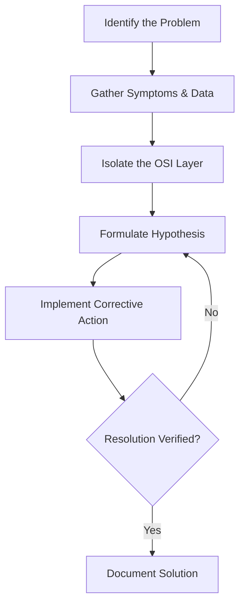

# Network Troubleshooting Guide & Interactive Lab

An interactive, practical laboratory designed to teach and demonstrate structured network diagnostics. This project combines automated scripts that simulate real-world infrastructure failures with an engineering playbook based on the **Cisco Troubleshooting Methodology**.

---

# Diagnostic Methodology

When a network component fails, network engineers typically follow either a **top-down** or **bottom-up** troubleshooting approach based on the OSI Model. The objective is to isolate the faulty layer, validate assumptions, implement corrective actions, and document the resolution.



---

# Lab Scenarios & Troubleshooting Playbook

> **⚠️ Warning**
>
> These labs intentionally modify temporary local network settings.
>
> They should only be executed inside a dedicated Linux virtual machine or testing environment.
>
> **Recommended operating systems:**
>
> - Ubuntu
> - Debian
> - Kali Linux (optional)

---

# Scenario 1 – The Dead Resolution (DNS Failure)

## Symptoms

- External IP addresses respond successfully.
- Domain names cannot be resolved.
- Applications such as `curl`, `wget`, or web browsers fail immediately.

Example:

```bash
curl google.com
```

Possible output:

```text
Could not resolve host: google.com
```

---

## Trigger the Failure

```bash
sudo bash broken-labs/break-dns.sh
```

---

## Diagnostic Procedure

### Step 1 – Verify Layer 3 Connectivity

Test whether IP connectivity still works.

```bash
ping -c 3 8.8.8.8
```

Expected result:

Successful replies indicate that the IP layer is functioning correctly.

---

### Step 2 – Test DNS Resolution

```bash
nslookup cisco.com
```

or

```bash
dig cisco.com
```

Expected result:

Timeout or connection errors indicate a DNS configuration problem.

---

### Step 3 – Inspect Resolver Configuration

```bash
cat /etc/resolv.conf
```

Observe that the configured nameserver points to an invalid or unreachable address.

---

## Resolution

Restore the original resolver configuration.

```bash
sudo cp /etc/resolv.conf.bak /etc/resolv.conf
```

Verify:

```bash
nslookup cisco.com
```

---

# Scenario 2 – The Black Hole (Routing Failure)

## Symptoms

- Local network communication works normally.
- Remote networks become unreachable.
- Internet access is completely unavailable.

---

## Trigger the Failure

```bash
sudo bash broken-labs/break-routing.sh
```

---

## Diagnostic Procedure

### Step 1 – Trace the Network Path

```bash
traceroute 1.1.1.1
```

Expected observation:

The trace stops immediately after the local host because no default route exists.

---

### Step 2 – Inspect the Routing Table

```bash
ip route show
```

Look for an entry similar to:

```text
default via 192.168.1.1 dev eth0
```

If it is missing, the operating system has no path toward external networks.

---

## Resolution

Restore the saved default gateway.

```bash
read -r GW DEV < /tmp/saved_gateway.txt

sudo ip route add default via "$GW" dev "$DEV"
```

Verify:

```bash
ip route show
```

Expected output:

```text
default via 192.168.x.x dev eth0
```

---

# Core Networking Toolkit

The following commands represent the fundamental toolkit used by network administrators during troubleshooting.

| Command | OSI Layer | Purpose |
|----------|-----------|---------|
| `ping` | Layer 3 (ICMP) | Verifies end-to-end connectivity |
| `ip route` | Layer 3 | Displays and modifies the routing table |
| `ip addr` | Layer 3 | Displays interface configuration |
| `traceroute` | Layer 3 / 4 | Identifies the forwarding path through the network |
| `nslookup` | Layer 7 | Performs DNS queries |
| `dig` | Layer 7 | Advanced DNS diagnostics |
| `curl` | Layer 7 | Tests HTTP/HTTPS connectivity |
| `ss` | Layer 4 | Displays listening sockets and active connections |

---

# Repository Structure

```text
.
├── broken-labs/
│   ├── break-dns.sh
│   ├── break-routing.sh
│   ├── restore-dns.sh
│   └── restore-routing.sh
│
├── docs/
│   └── troubleshooting-guide.md
│
├── screenshots/
│
├── README.md
└── LICENSE
```

---

# Learning Objectives

By completing this laboratory, you will gain hands-on experience with:

- Structured network troubleshooting
- Cisco troubleshooting methodology
- DNS diagnostics
- IP routing fundamentals
- Linux networking
- ICMP testing
- Route analysis
- Name resolution
- Layer-by-layer fault isolation
- Practical command-line network administration

---

# Skills Demonstrated

This project showcases knowledge in:

- Linux Administration
- Network Troubleshooting
- Cisco Networking Fundamentals
- TCP/IP
- DNS
- Routing
- Bash Scripting
- Infrastructure Diagnostics
- Incident Investigation
- Problem Solving

---

# Future Improvements

Potential enhancements include:

- DHCP troubleshooting scenarios
- Firewall (iptables/nftables) failures
- VLAN misconfiguration labs
- IPv6 troubleshooting
- MTU mismatch simulations
- TCP handshake analysis
- Wireshark packet capture exercises
- Docker-based network topology
- Interactive challenge mode
- GitHub Actions validation workflows

---

# License

This project is distributed under the **MIT License**.

See the `LICENSE` file for additional information.

---

# Author

**Roberto Delgado**

Senior Cybersecurity Consultant

Cybersecurity | Cloud Security | DevSecOps | Infrastructure Security | Security Automation
